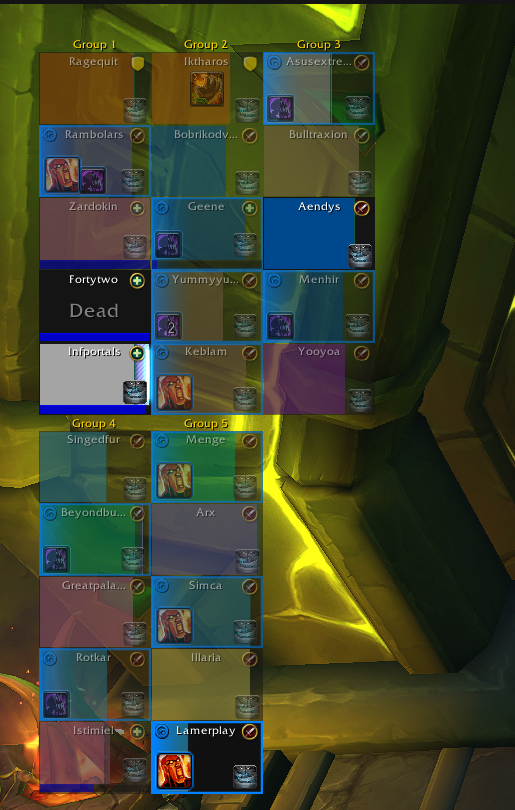
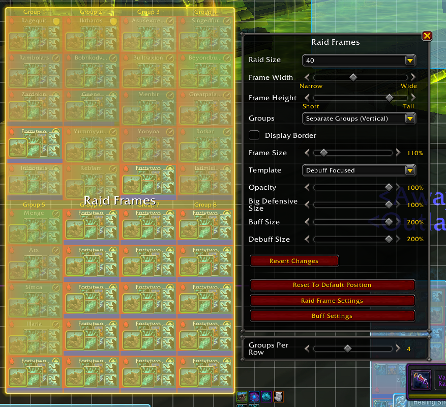

<h1 align="center">Raid Group Wrap</h1>

<b>Blizzard's raid frames, but eight groups no longer stretch across your whole screen.</b>

## Why players install it

- **Pick how many groups sit on one line.** Four groups per row turns one long strip into a tidy 4×2 block.
- **It's Blizzard's raid frames.** Same frames, same order, same spacing. Only the line breaks change.
- **Works both ways.** Groups side by side wrap into new rows; stacked groups wrap into new columns.
- **Nothing to learn.** The slider sits right under the Raid Frames settings in Edit Mode.

## Screenshots

  
  

## Settings

1. Open **Edit Mode** and click the **Raid Frames**.
2. Pick one of the **Separate Groups** layouts.
3. Use the **Groups Per Row** (or **Groups Per Column**) slider under the settings window.
   Tick **Odds / Evens** for odd groups on top and even groups below (for example 1-3-5-7 over 2-4-6-8 at 4 per row).

8 is Blizzard's normal layout. Your choice is saved for all your characters.

Combine Groups layouts already have Blizzard's own Row Size option, so the slider only shows for Separate Groups.

## In combat

WoW doesn't let addons move raid frames during combat. If your raid changes mid-fight, or you open Edit Mode in combat, Blizzard's layout shows until combat ends, then your layout comes back on its own. The slider is greyed out while you're in combat.

## Game versions

Retail and WoW: Forever.

## Performance

- No per-frame updates and no timers: it only runs when the game itself rearranges the raid frames.
- At 8 groups per line it does nothing at all.
- No libraries.

## License

MIT
